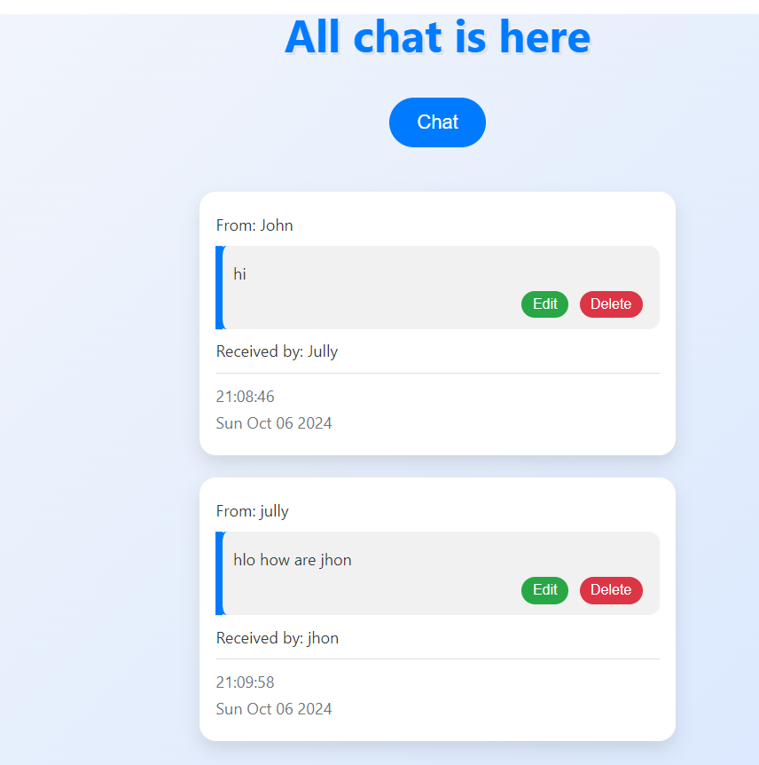

# 📨 Simple Chat Box API

 
 

This project is a **Simple Chat Box API** built using **Express.js** and **MongoDB** to demonstrate the core functionality of RESTful APIs. The application allows users to send, edit, and delete messages between a sender and a receiver. It is designed to provide hands-on experience with CRUD operations using RESTful methods (GET, POST, PUT, DELETE).

---

## 🚀 Features

- **Create Messages**: Send messages between users, specifying the sender, receiver, and message.
- **Retrieve Messages**: Fetch all messages stored in the chat system.
- **Edit Messages**: Update messages via full updates (PUT) or partial updates (PATCH).
- **Delete Messages**: Remove messages from the system by ID.
- **User-Friendly Views**: Messages are displayed in an easy-to-read format.

---

## 🛠️ Technologies Used

- **Node.js**: JavaScript runtime used for backend development.
- **Express.js**: Web framework for building RESTful APIs.
- **MongoDB**: NoSQL database for storing chat data.
- **EJS**: Templating engine to render views.
- **Method-Override**: Middleware to handle PUT and DELETE requests in HTML forms.
- **Mongoose**: Object Data Modeling (ODM) library for MongoDB and Node.js.

---

## 📚 API Routes (Theoretical Overview)

### 1. **GET** `/chats`
- **Purpose**: Retrieve all chat messages.
- **Description**: This route fetches all chat messages from the database. Each message contains the sender’s name, receiver’s name, message content, and a timestamp indicating when the message was sent.
- **Use Case**: Display the full chat history between users.

---

### 2. **GET** `/chats/new`
- **Purpose**: Display form for creating a new chat message.
- **Description**: This route renders a form where users can input the sender, receiver, and message content to create a new message. It allows users to initiate a conversation or continue an ongoing chat.
- **Use Case**: Allow users to type and send new messages from the frontend interface.

---

### 3. **POST** `/chats`
- **Purpose**: Send a new message.
- **Description**: This route processes the form submission for a new chat message. The submitted data includes the sender’s name, receiver’s name, and the message content. After successful submission, the message is saved to the MongoDB database.
- **Use Case**: Add a new chat message to the conversation between two users.

---

### 4. **GET** `/chats/:id/edit`
- **Purpose**: Render form to edit an existing message.
- **Description**: This route renders a form pre-populated with the content of a specific chat message identified by its unique ID. The user can modify the message content and submit the changes.
- **Use Case**: Allows users to edit or correct a message they have previously sent.

---

### 5. **PUT** `/chats/:id`
- **Purpose**: Update an entire message.
- **Description**: This route is used to completely update the content of an existing message. The `PUT` method replaces the entire message content with new data provided in the form.
- **Use Case**: Use this method when a message needs to be fully rewritten or replaced.

---

### 6. **DELETE** `/chats/:id`
- **Purpose**: Delete a specific message.
- **Description**: This route deletes a chat message from the database based on its unique ID. Once deleted, the message will no longer appear in the chat history.
- **Use Case**: Remove a message that is no longer needed or contains inappropriate content.

---

### 7. **PATCH** `/chats/:id`
- **Purpose**: Partially update a message.
- **Description**: This route allows for a partial update of a chat message. Instead of replacing the entire message, it updates only the specified field, such as correcting a typo in the message content.
- **Use Case**: Use this method to make small changes to a message without altering other parts of it.

---
